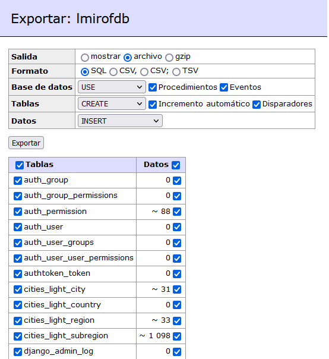

# LMIROF_Core

Manage products LMIROF Store

# Data Inicial

Para agregar data initial en una aplicacion se puede realizar a traves de un archivo .json el cual debe estar siempre en una carpeta llamada "fixtures" dentro de cada aplicacion de Django. Debera ejecutar el comando de la siguiente manera:

```sh
python .\manage.py loaddata initial_data
```

# Cities Light Data import/update

Finally, populate your database with command:

```sh
python ./manage.py cities_light
```

## Captura para restaurar la base de datos a traves de adminer


